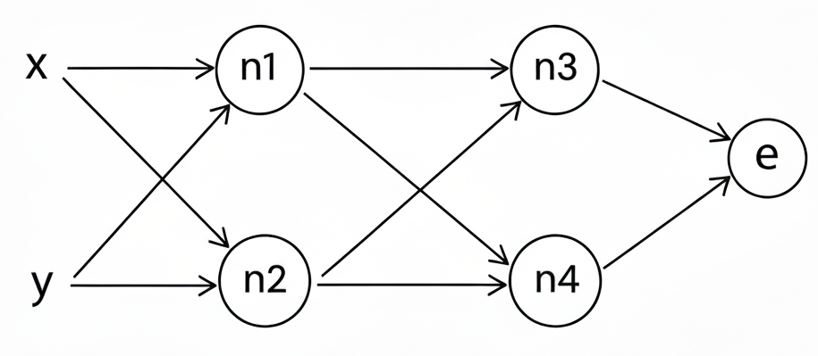

## At `test_rad_engine.py`
I used a small network with **2 hidden layers (2 neurons each)** and **1 output neuron**.  
I intentionally included a variety of operations (multiplication, addition, ReLU, tanh, power, …) since the goal here is just to verify that the engine works correctly.  

---

## At `test_nn.py`
This test uses a slightly larger network: **2 hidden layers (3 neurons each)** and **2 output neurons**.  
The ReLU activation is used in all layers except the output layer.  
In the function `my_nn()`, after initializing my network, I copied all the weights into the PyTorch version of the same network so that both start with exactly the same initial weights.  

